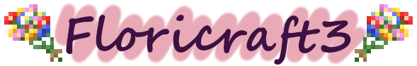

Floricraft3 is an ornamental horticulture mod for Minecraft. Get new effects from flowers and color your world!

## Required Dependencies

+ [Flora Lib](https://www.curseforge.com/minecraft/mc-mods/flora-lib)

## Optional Dependencies

+ [Botania](https://www.curseforge.com/minecraft/mc-mods/botania)
+ [Tetra](https://www.curseforge.com/minecraft/mc-mods/tetra)

## License

This mod is released under [the MIT License](/LICENSE).

## Author

+ Hosta_Plantain

